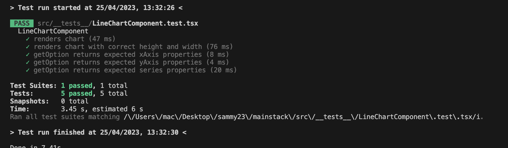
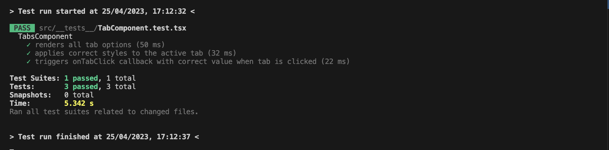
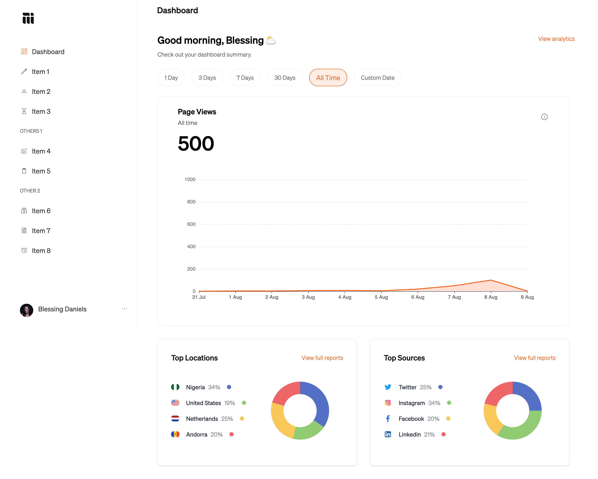

# Mainstack Dev Project
This project was created using create-react-app. The project uses the following technologies:

- React
- TypeScript
- TailwindCSS
- ECharts
- Jest
- Storybook

## Installation
To install and run the project, clone the repository and run the following commands:

```bash
yarn install
yarn start
```

This will start the development server and open the application in the browser.

## Testing
I setup a testing environment and added a sample unit test with Jest.
To run tests, run the following command:
```bash
yarn test
```
##### LineChartComponent test


##### TabsComponent test



## UI Components and Documentation

I integrated storybook to create an interactive documentation for the components, showcasing different states, variations, and usage examples.

The reusable component in this project were the `CardComponent` and `TabsComponent`, so i created stories for them. 

View it here: [Card Component Story](https://6447defcd304575e2d4f9558-uuxukeobxz.chromatic.com/?path=/docs/card--docs)

### ScreenCapture
[](https://res.cloudinary.com/sammy365/video/upload/v1682433958/storybook_oqvogo.webm "UI Documentation")


## Preview

### Desktop View


- [Mobile View](https://github.com/Umoren/mainstack-dev/blob/master/public/screenshots/mobilescreen.png)

- [Mobile Sidebar](public/screenshots/mobile2.png);
