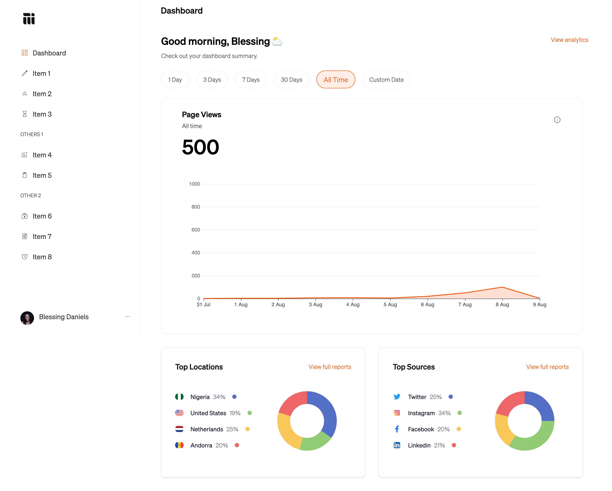

# Mainstack Dev Project
This is a sample project created using create-react-app. The project uses the following technologies:

- React
- TypeScript
- TailwindCSS
- ECharts

## Installation
To install and run the project, clone the repository and run the following commands:

```bash
yarn install
yarn start
```

This will start the development server and open the application in the browser.

## Testing
I setup a testing environment and added a sample unit test with Jest.
To run tests, run the following command:
```bash
yarn test
```

## Preview

;